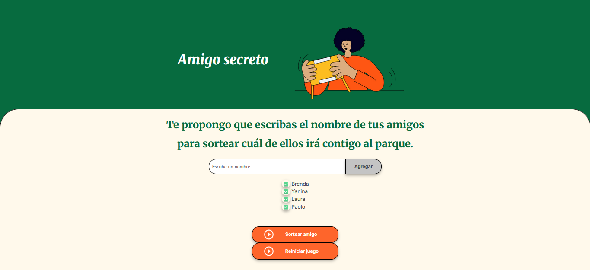
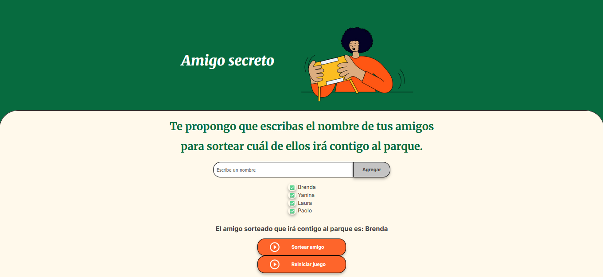
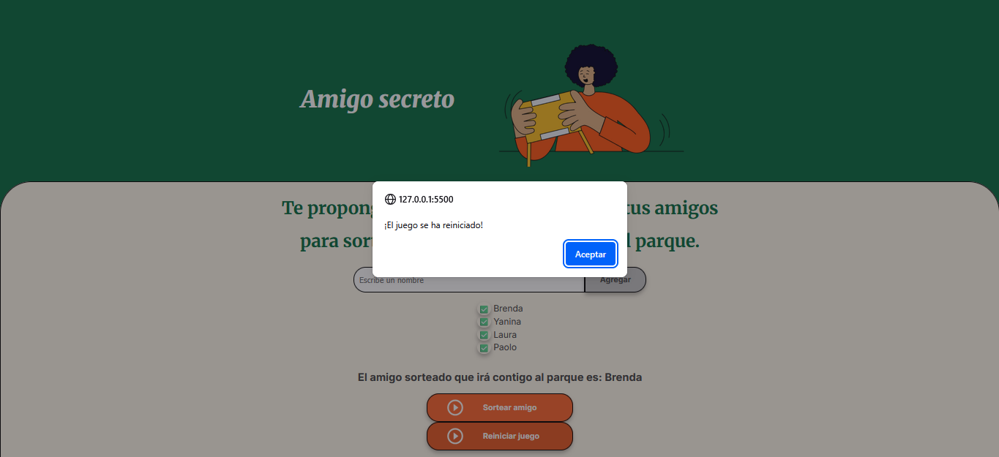

<h1>Challenge Amigo Secreto</h1>

Este proyecto es una pequeña aplicación web. Es interactiva y permite agregar nombres de amigos para descubrir mediante un sorteo quién es el "amigo secreto" que irá con el jugador de paseo a un parque. Esta aplicación se relizó como parte de un challenge de una formación de Alura Latam.

___

<h2>🎮 ¿Cómo jugar?</h2>

* En primera instancia debes anotar nombres de amigos que quieran acompañartea dar un paseo a un parque.

* Apreta el botón "Sortear amigo" y ¡listo! Ya estará develado el misterio del amigo que te acompañará a dar un paseo por el parque.

* Por último, apretando el botón "Reiniciar juego" tienes la chance de seguir jugando pudiendo volver a realizar un sorteo.

* ¡Ahora ya sabes cómo jugar al "Amigo secreto"! 

___
